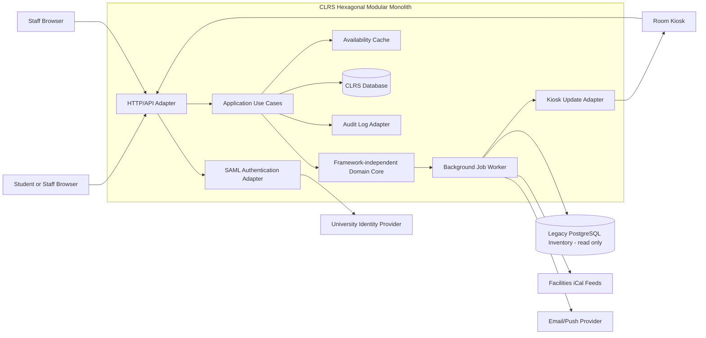

# CS 3410 Software Engineering — Assignment 2  
## Architecture and Quality Plan for the Campus Library Reservation System

**Student ID:** `<studentid>`  
**Semester:** Fall 2026  

---

## 1. Context and scope

The Campus Library Reservation System (CLRS) will replace the university’s ageing study-room reservation tool. It will support students and staff across three libraries. Students will search for rooms and equipment, create or modify reservations, cancel reservations, and receive reminders. Library staff will manage rooms, opening hours, recurring block bookings and utilisation reports. Kiosks outside rooms will display the current and next reservation.

CLRS must integrate with three existing systems: the university identity provider through SAML, facilities calendars through iCal feeds, and a read-only PostgreSQL room-inventory database. The first release covers the functional requirements FR-1 to FR-6 and the quality requirements QR-1 to QR-6.

The proposed system prioritises correctness of reservation rules, dependable operation during semester-start demand, simple deployment by a two-person team, and isolation from unreliable external systems. The design must also allow a new library to be added through configuration rather than code changes.

The selected architecture is **Method C: Hexagonal Architecture**, implemented as a modular monolith. The domain and application logic will be independent of web frameworks, databases, authentication providers and notification services. External systems will be accessed through explicit ports and adapters. This provides strong unit testability while retaining the operational simplicity of one deployable application.

---

## 2. Architectural decision

### 2.1 Decision

CLRS will use a **hexagonal architecture with a framework-independent domain core**. The first release will be deployed as one application with separate internal modules for reservations, room availability, staff administration, kiosks, notifications and reporting.

The architecture has three conceptual areas:

1. **Domain core**  
   Contains reservation entities, room rules, booking conflicts, daily limits, recurring block-booking rules and domain events. It has no dependency on HTTP, SAML, PostgreSQL or a particular notification provider.

2. **Application services**  
   Coordinate use cases such as searching rooms, creating reservations, modifying reservations, cancelling reservations, creating block bookings and generating reports. They depend on interfaces, or ports, rather than concrete infrastructure.

3. **Adapters**  
   Translate external protocols into application calls and application results into external protocols. Examples include the HTTP API, SAML adapter, PostgreSQL adapter, iCal importer, email/push adapter and kiosk adapter.

### 2.2 Rationale against the quality requirements

**QR-1 — Availability.**  
A single deployable application is easier for a two-person team to operate than several independently deployed services. It can use multiple application instances behind a load balancer and a highly available database. External integrations are isolated behind adapters, so a failure in iCal synchronisation or notifications does not prevent reservations. Kiosks cache their last successful schedule locally and display it with an “offline/last updated” indicator when the CLRS API cannot be reached.

**QR-2 — Performance.**  
Availability searches will use a local, indexed availability representation rather than querying the legacy inventory system on every request. Room metadata imported from PostgreSQL and calendar data from iCal will be cached in the CLRS database. Indexes will cover campus, capacity, equipment and time ranges. The application can scale horizontally because requests are stateless apart from the database and cache. A performance test will verify p95 search latency below 400 ms with 2,000 concurrent users.

**QR-3 — Security.**  
Authentication is represented by an inbound `IdentityProvider` port. The SAML adapter validates assertions and maps them to an internal user identity and role. The domain never handles SAML details. Staff operations pass through an audit port, which writes an immutable audit record containing the actor, action, target, timestamp and outcome. Application logging uses user and reservation surrogate IDs rather than names, email addresses or SAML assertions, ensuring that PII is not written to logs.

**QR-4 — Modifiability.**  
Campus-specific information will be represented as configuration: campus identifier, opening hours, timezone, room source, feature mappings and kiosk settings. Room and equipment metadata are data, not conditional code. The application services operate against generic campus and room ports. Therefore, onboarding a fourth library should involve configuration and data loading only.

**QR-5 — Testability.**  
The reservation rules are implemented in the domain core using in-memory values and interfaces. For example, the three-hour daily limit and overlap rules can be tested by passing a user, requested time interval and existing reservations to a domain service. No database, SAML provider or network connection is required. Hexagonal boundaries also permit fake clock, fake reservation repository and fake notification ports in tests.

**QR-6 — Operability.**  
The system will initially have one deployable artifact and one primary database, reducing operational overhead. Container images will be immutable and deployments will be automated. A previous image remains available for rapid rollback. Backward-compatible database migrations and blue/green or rolling deployment support rollback within ten minutes.

### 2.3 Rejected alternatives and trade-offs

#### Method A — Layered monolith

A layered monolith would also be simple to deploy and could satisfy QR-1, QR-2 and QR-6. However, conventional layered systems often allow application code to depend directly on framework and persistence classes. Over time, this makes reservation rules difficult to test without a database, weakening QR-5. It can also make external-system failures leak into core logic. Hexagonal architecture adds interfaces and adapter discipline to avoid this coupling.

The cost of the selected approach is additional design overhead: ports, adapters and dependency-injection configuration require more code than a straightforward layered implementation.

#### Method B — Microservices

Microservices could independently scale search, notifications and reporting. They would provide stronger fault and deployment isolation if CLRS became very large. However, they would introduce multiple repositories, services, deployment pipelines, network calls, monitoring systems and possibly distributed transactions. This conflicts with QR-6 because a two-person team would need to operate more infrastructure. Reservation consistency would also be harder to guarantee across service boundaries. The first release does not justify that complexity.

The selected design gives up independent service scaling and independent release schedules. Internal module boundaries preserve a future extraction path if later demand requires it.

#### Method D — Event-driven architecture with CQRS

CQRS and event sourcing could provide excellent kiosk and search read performance, replayable history and natural asynchronous notifications. It would also support high write/read separation. However, it introduces eventual consistency: a search result or kiosk could temporarily lag behind a reservation command. That complicates FR-2 conflict handling and the ten-second kiosk requirement. Event schemas, projections, replay operations and an event-log platform would add significant operational and testing complexity.

The selected architecture may use small internal domain events, such as `ReservationChanged`, for notification and kiosk invalidation, but it will not make the whole system event-sourced or CQRS-based. This retains synchronous reservation correctness while allowing asynchronous side effects.

---

## 3. Structure

### 3.1 Container/component diagram

The diagram shows logical components; the application, worker and adapters are packaged in one deployable release unless operational testing demonstrates that a separate worker process is necessary.

### 3.2 FR-1 walkthrough: search available rooms

1. A user sends `GET /rooms?campus=L1&capacity=4&equipment=display&from=...&to=...`.
2. The HTTP adapter validates syntax, obtains the authenticated internal user identity and invokes `SearchAvailableRooms`.
3. The use case asks the room catalogue and availability ports for matching rooms.
4. The PostgreSQL and iCal adapters have already imported room metadata, opening hours and external calendar exclusions into the local database.
5. The search repository uses indexed campus, capacity, equipment and time-range data. It excludes student reservations, staff block bookings, closures and external calendar conflicts.
6. Results are returned without exposing internal database details.

Search is read-only and can use a short-lived cache. Cache invalidation occurs when a reservation changes or synchronisation imports new calendar data. The reservation creation operation still performs an authoritative conflict check in a database transaction, preventing two users from successfully reserving the same interval.

### 3.3 FR-4 walkthrough: kiosk schedule refresh

1. A kiosk authenticates using a kiosk-specific credential and requests `GET /kiosk/{roomId}/schedule`.
2. The kiosk stores the complete response and its timestamp locally.
3. When a reservation is created, modified, cancelled or overridden by a block booking, the domain emits `ReservationChanged`.
4. An application event handler invalidates the room schedule cache and sends a lightweight update notification to the affected kiosk, using server-sent events or polling as a fallback.
5. The kiosk retrieves the new schedule. The service records the change time and the kiosk acknowledgement time.
6. The target is that the updated schedule is visible within ten seconds. If the network or server is unavailable, the kiosk continues displaying its last-known schedule and clearly shows its last refresh time. It does not claim that the cached schedule is current.

---

## 4. Quality plan

### 4.1 Testing strategy

#### Unit tests

Unit tests will cover the framework-independent domain core and application policies:

- reservation overlap and conflict detection;
- the three-hour-per-day user limit;
- modification and cancellation permissions;
- staff block bookings and 48-hour notice rules;
- recurring booking expansion;
- opening-hours validation;
- campus configuration interpretation;
- reminder timing;
- kiosk schedule projection;
- report utilisation calculations.

These tests use in-memory objects, fake repositories and a controllable clock. They do not require a database, web server or network, directly satisfying QR-5. Boundary-value cases will include reservations at opening and closing times, adjacent reservations, daylight-saving transitions, duplicate requests and conflicting recurring bookings.

#### Adapter and integration tests

Integration tests will verify each adapter against controlled test dependencies:

- SAML assertion validation, role mapping and expired-assertion rejection;
- PostgreSQL schema queries and read-only permissions;
- iCal parsing, timezones, malformed feeds and duplicate events;
- email/push provider request handling and retry behaviour;
- database transactions, unique constraints and concurrent reservation attempts;
- cache invalidation and background-job persistence.

A containerised PostgreSQL instance will be used in CI. External providers will use mocks or sandbox endpoints. Integration tests will verify that an adapter cannot bypass authentication or write to the legacy inventory database.

#### Contract tests

Contracts will be maintained for:

- the public HTTP API;
- kiosk schedule responses;
- SAML attribute assumptions;
- iCal feed format;
- notification-provider requests.

Consumer-driven contracts will ensure that changes to response fields do not break kiosks or staff reporting clients. API examples will specify status codes, including `409 Conflict` for reservation conflicts and authentication/authorisation failure responses.

#### End-to-end tests

A small set of end-to-end tests will run against a deployed test environment:

1. authenticate a student through a SAML test identity provider;
2. search for a room;
3. create a reservation;
4. verify that the room is no longer available;
5. modify and cancel the reservation;
6. create a staff block booking and verify the 48-hour rule;
7. verify that a kiosk receives the changed schedule;
8. verify that a reminder job is created.

End-to-end tests will not attempt to cover every business-rule combination; that responsibility belongs to unit tests. This keeps the suite reliable and fast.

#### Non-functional testing

Load tests will model at least 2,000 concurrent users at semester start, with search as the dominant operation and a realistic mixture of reservation writes. The acceptance criterion is search p95 below 400 ms, with error rate and database saturation also monitored.

Resilience tests will stop the iCal feed, notification provider, cache and one application instance independently. Reservations must remain usable when non-critical integrations fail. Kiosk network loss must demonstrate use of the last-known schedule.

Security tests will include dependency scanning, static analysis, authorisation tests, log inspection for PII, SAML replay/expiry tests and attempts to access another user’s reservation.

### 4.2 Delivery and rollback

The team will use short-lived feature branches merged through pull requests into `main`. Each pull request requires:

- successful compilation and linting;
- unit and adapter tests;
- integration tests;
- static analysis and dependency vulnerability scanning;
- contract tests;
- database migration validation;
- minimum agreed code coverage for domain rules;
- peer review by the second engineer.

`main` must remain deployable. Releases are tagged and built into immutable container images. Deployment proceeds automatically to a staging environment, where smoke, contract and selected end-to-end tests run. Production uses a rolling or blue/green deployment with health checks.

Database changes follow an expand-and-contract pattern:

1. add backward-compatible schema;
2. deploy code that supports both old and new fields;
3. migrate data;
4. remove obsolete fields only in a later release.

This ensures that the previous application version can run during rollback. Rollback is performed by selecting the previous image and reverting application traffic. The operational runbook will be rehearsed in staging and must restore service within ten minutes. Feature flags will be used for risky features such as push kiosk updates or a new search index.

### 4.3 Observability

#### Logs

Structured logs will include:

- timestamp, severity and correlation ID;
- operation name and outcome;
- latency;
- campus and room surrogate IDs where appropriate;
- reservation surrogate ID;
- dependency name and failure category;
- kiosk ID and schedule version;
- deployment version.

Logs will not include names, email addresses, SAML assertions, session tokens, access tokens or reservation descriptions. Audit records are separate from diagnostic logs and contain the minimum information required for staff accountability.

#### Metrics

The system will measure:

- successful request availability during configured opening hours;
- HTTP 5xx and timeout rates;
- search latency p50, p95 and p99;
- concurrent requests and throughput;
- database connection pool utilisation and query latency;
- cache hit/miss ratio;
- reservation conflict rate;
- iCal synchronisation age and failure count;
- notification queue depth and delivery latency;
- kiosk schedule-change-to-display latency;
- number of kiosks using stale schedules;
- application instance health.

#### Alerts and service objectives

Alerts will include:

- search p95 above 400 ms for five consecutive minutes under normal load;
- search p95 above 400 ms during a load-test or semester-start observation window;
- elevated 5xx rate, such as over 1% for five minutes;
- projected monthly opening-hours availability below the 99.5% budget;
- no successful iCal import for 30 minutes;
- kiosk update latency above ten seconds for more than 5% of changes over ten minutes;
- any kiosk schedule older than an agreed threshold, such as 30 minutes;
- notification queue age above ten minutes;
- database CPU, storage or connections above 80%.

A dashboard will show the QR-1 and QR-2 measurements by campus, endpoint and deployment version. Synthetic probes will periodically search rooms and retrieve kiosk schedules from outside the production network.

---

## 5. Trade-off Ledger

The ledger records technical and project risks, including accumulated design entropy: the gradual increase in complexity caused by shortcuts, undocumented decisions and inconsistent integrations.

| Risk | Likelihood | Impact | Measurable trigger | Mitigation |
|---|---|---|---|---|
| Concurrent reservation requests create double bookings | Medium | High: loss of user trust and incorrect schedules | Any production duplicate interval detected, or concurrency test produces one | Enforce authoritative conflict checks in a database transaction with suitable constraints/locking; run concurrent-write integration tests; alert on duplicate overlaps |
| Search performance fails at semester start | Medium | High: QR-2 breach and unusable service | Load test or production search p95 exceeds 400 ms for five minutes; database CPU exceeds 80% | Precompute/index availability data; cache read-only searches; load-test before release; add application instances and tune indexes; retain a simple fallback query |
| External iCal or inventory systems are unavailable or inconsistent | High | Medium/High: inaccurate availability | Feed import older than 30 minutes, parse failure rate above 1%, or inventory connection errors above 5% | Import asynchronously; retain last successful data with freshness status; validate feeds; use circuit breakers and alerts; obtain written ownership and escalation contacts |
| SAML integration or role mapping is incorrect | Medium | High: users cannot access the system or unauthorised staff actions occur | Authentication failure rate above 2%, or any unauthorised staff-action test succeeds | Build against a SAML test provider; contract-test required attributes; deny by default; review role mappings; audit all staff actions; rehearse identity-provider outage behaviour |
| Kiosk updates exceed ten seconds or kiosks display misleading stale data | Medium | Medium/High: visible operational failure | More than 5% of updates exceed ten seconds, or any kiosk cache is older than 30 minutes without an offline indicator | Use push with polling fallback; persist schedule versions; local kiosk cache; display last-updated time; monitor acknowledgements and test network loss |
| Notification provider outage causes missed reminders | Medium | Medium: users miss reservations | Queue age exceeds ten minutes or delivery failure exceeds 5% | Use a durable outbox and retry with backoff; make notification sending asynchronous; provide provider failure metrics; avoid making reservation creation depend on notification success |
| Scope expands beyond a two-person team | Medium | High: delayed or unreliable release | More than two unplanned integrations/features enter the release, or sprint carry-over exceeds 25% for two sprints | Prioritise FR-1 to FR-6; use configuration for campuses; defer nonessential features; review scope weekly with the product owner |
| Design entropy develops at adapter boundaries | Medium | Medium: increasing change cost and test failures | More than three direct infrastructure dependencies in domain/application packages, or repeated duplicated campus-specific conditionals | Enforce dependency-direction checks; require architecture review for new adapters; maintain ADRs and port contracts; refactor duplicated rules before release |
| Deployment rollback takes too long or schema is incompatible | Low/Medium | High: prolonged outage | Staging rollback exceeds eight minutes or previous version fails its smoke tests | Immutable images; expand-and-contract migrations; automated rollback command; quarterly rollback rehearsal; keep the previous image and migration compatibility tests |
| PII is accidentally written to logs | Low | High: privacy and compliance breach | Static log scan finds an email/token, or a production log review finds any PII | Structured allow-listed fields; log redaction middleware; security tests and automated scans; restrict log access; document incident response |

Risk review will occur each iteration. A triggered risk becomes a release-blocking issue when its threshold threatens QR-1, QR-2, QR-3 or QR-6.

---

## 6. Open questions for the product owner

1. What is the authoritative source when facilities iCal data conflicts with the legacy room-inventory database?
2. Which staff roles may create block bookings, override reservations and export reports?
3. Does “48 hours’ notice” mean 48 elapsed hours or two calendar days in the campus timezone?
4. How should users be notified when a block booking overrides an existing student reservation?
5. Are reservations allowed to cross midnight, and how is the three-hour daily limit calculated across midnight?
6. What are the exact opening hours and timezones for each current and future library?
7. What is the required retention period for audit records and utilisation reports?
8. Which email and push providers are approved, and what delivery guarantees are available?
9. What is the maximum acceptable age of a kiosk’s last-known schedule while offline?
10. Should room equipment be searchable only from the legacy inventory database, or can staff edit equipment metadata in CLRS?
11. What availability and performance reporting is required during the first semester-start load event?
12. What accessibility, browser and kiosk hardware standards must the first release support?

---

## Appendix A — AI-use declaration

*Edit this declaration so that it accurately reflects the tools and process used.*

> I used a generative AI tool to assist with brainstorming, organising and editing this architecture and quality-plan document. I reviewed the output, checked it against the assignment requirements, and remain responsible for the final design decisions, technical accuracy and submitted work. The final document was adapted to reflect my own understanding and course material.