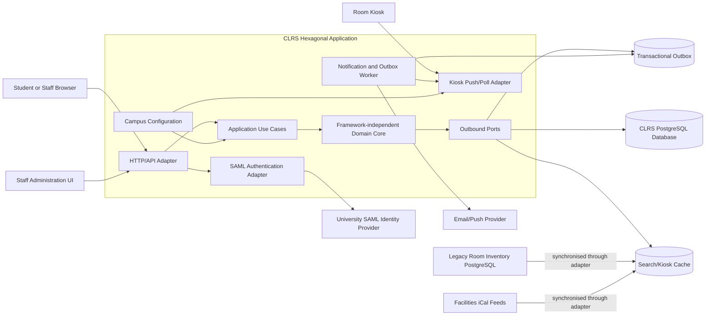

# CS 3410 Software Engineering — Assignment 2  
## Architecture and Quality Plan for the Campus Library Reservation System

## 1. Context and scope

The Campus Library Reservation System (CLRS) will replace the existing study-room reservation tool used across three university libraries. Students and staff will search for rooms and equipment, create or modify reservations, and cancel bookings. Library staff will manage opening hours, rooms and recurring block bookings. Kiosks outside rooms will display the current and next reservation.

CLRS must integrate with three existing systems: the university identity provider using SAML, facilities calendars through iCal feeds, and a read-only PostgreSQL room-inventory database. It must also provide reminders, utilisation reports and reliable kiosk updates.

This document defines the architecture for the first release and the quality plan that will guide implementation. The design focuses on the six stated quality requirements: availability, performance, security, modifiability, testability and operability. It does not specify detailed user-interface designs, vendor selection or the final visual design of kiosk screens.

The recommended architecture is a **hexagonal architecture with a modular application core**. The reservation rules remain independent of databases, networks and web frameworks. External systems are connected through ports and adapters. This provides strong testability and makes it possible to add campuses through configuration rather than code changes, while avoiding the operational overhead of multiple independently deployed services.

---

## 2. Architectural decision

### 2.1 Decision

CLRS will use **Method C: Hexagonal architecture**, also known as ports-and-adapters architecture.

The central application core contains the domain model and use cases. It communicates with the outside world through interfaces, or ports. Adapters implement those ports for HTTP, SAML, PostgreSQL, iCal, email/push providers and kiosk communication.

The first release will be deployed as a modular application rather than as several independently deployed services. Internally, the modules will be separated into reservation, room catalogue, notifications, reporting, kiosk and administration areas. This preserves clear boundaries without introducing unnecessary distributed-system complexity.

The reservation database will be the authoritative source for reservations. Search data may be cached or maintained in locally indexed tables, but creating or changing a reservation will always recheck availability against the authoritative reservation store in a transaction.

### 2.2 Rationale against the quality requirements

#### QR-1 — Availability

A modular monolith has fewer runtime components than a microservice or event-driven solution. There is one primary application deployment and one transactional database, reducing the number of network calls and independently failing services. This is appropriate for a small two-person operations team.

Kiosks will use a kiosk-specific read endpoint and retain the last successfully retrieved schedule locally. If the network or CLRS is unavailable, the kiosk will show the cached schedule with its retrieval timestamp and an “offline” indicator. When connectivity returns, it refreshes automatically. This directly supports graceful degradation.

The application will use health checks, database connection pooling and multiple application instances behind a load balancer. Database backups and restore tests will be part of operations.

#### QR-2 — Performance

The search use case will read from a locally indexed room and availability representation rather than repeatedly querying the read-only legacy inventory database or remote iCal feeds. Indexes will cover campus, capacity, equipment and time ranges. Frequently requested room metadata can be cached.

The reservation creation path is separate from the search path. Search can be optimised for read throughput, while reservation commands perform the authoritative conflict check. This separation prevents search traffic from weakening reservation consistency.

The target is p95 search latency below 400 ms under a load of 2,000 concurrent users. The design supports horizontal scaling of the application while retaining a shared database. If performance testing shows that the database is the bottleneck, a read replica or dedicated search index can be introduced behind the existing outbound search port without changing the domain core.

#### QR-3 — Security

Authentication is isolated behind an `IdentityProvider` port. A SAML adapter validates assertions from the university identity provider and maps users to application identities and roles. The application core receives an authenticated user context rather than dealing directly with SAML details.

Authorisation is enforced in the application use cases, not only in the user interface. For example, only staff roles can create block bookings or export reports. Staff actions produce audit records containing the actor identifier, action type, target resource and timestamp.

Application logs will contain correlation IDs, operation names and outcomes, but not names, email addresses, SAML assertions, reservation descriptions or other unnecessary PII. Identifiers will be pseudonymised or represented by internal IDs. Audit records will be access-controlled separately from ordinary diagnostic logs.

#### QR-4 — Modifiability

Campus, library, room and opening-hour information will be represented as configuration and managed data. Adding a campus will require adding its identifier, time zone, opening hours, facilities-calendar source and room-inventory mapping. The code will not contain campus-specific conditionals.

External integrations are adapters behind ports. For example, a new calendar source can implement the calendar port without changing reservation rules. This limits the impact of changes to infrastructure or supplier systems.

#### QR-5 — Testability

The domain core has no dependency on HTTP, SAML, PostgreSQL, iCal or external notification services. Reservation rules are expressed as pure use-case and domain logic. Tests can supply in-memory implementations of ports.

For example, a `CreateReservation` use case can receive an in-memory room repository and reservation repository. Tests can verify the three-hour daily limit, overlapping reservations, block-booking overrides and authorisation without starting a database or network service. This directly satisfies QR-5 and makes the most important business rules fast and deterministic to test.

#### QR-6 — Operability

A single primary deployable is simpler for a two-person team to build, monitor and recover than four independently deployed microservices. Releases will use an immutable container image and a backward-compatible database migration process. The previous image remains available so that rollback can be performed quickly.

A rolling or blue-green deployment will be used, depending on the hosting platform. A rollback runbook will be tested during staging and must restore the previous application version within ten minutes. Feature flags can disable non-critical functions such as report generation or push notifications without disabling core reservations.

### 2.3 Rejected alternatives and trade-offs

#### Method A — Layered monolith

A layered monolith would be easy to deploy and may be sufficient for QR-6. However, conventional layered designs often allow application and domain code to depend directly on frameworks and database repositories. That would make QR-5 weaker because reservation rules become difficult to execute without infrastructure.

It would also make external integration details spread through the application layer. Hexagonal architecture provides the same deployment simplicity while enforcing stronger dependency boundaries. The trade-off is a small amount of additional interface and adapter code.

#### Method B — Microservices

Microservices could independently scale search, notifications and reporting. They would also isolate failures more strongly if designed and operated well. However, they introduce service discovery, API versioning, distributed tracing, deployment coordination, inter-service authentication and possible distributed transaction problems.

Reservation and block-booking operations require consistent conflict handling. Splitting this logic across services could make correctness harder to guarantee. Microservices would therefore increase operational risk for a two-person team and make QR-6 harder to meet. The design gives up independent service scaling and independent release schedules in exchange for simpler operations and transactional consistency.

#### Method D — Event-driven architecture with CQRS

CQRS and an event log would be attractive for kiosk updates, notifications, reporting and high-volume search. Reservation events could update read models asynchronously. However, this introduces eventual consistency: a search or kiosk projection might temporarily show outdated availability immediately after a reservation. Additional event replay, idempotency, ordering and projection-recovery mechanisms would be required.

This design gives up the scalability and natural event distribution of CQRS. Instead, the selected architecture uses transactional reservation updates plus an outbox and background worker for reliable notifications and kiosk invalidation. This provides asynchronous side effects without making the core reservation decision eventually consistent.

---

## 3. Structure

### 3.1 Container/component diagram

The diagram shows logical boundaries rather than necessarily separate processes. The HTTP adapter, use cases, domain core and adapters may be packaged in one application image. The worker can run as a separate process from the same image if required, but it shares the same codebase and deployment version.

### 3.2 Main components

- **HTTP/API adapter:** Implements endpoints such as `/rooms`, `/reservations`, `/block-bookings`, `/kiosk` and `/reports`. It validates request shape and converts requests into application commands.
- **SAML adapter:** Authenticates users and maps university attributes to internal user IDs and roles.
- **Application use cases:** Coordinate operations such as search, create reservation, cancel reservation, create block booking, export report and refresh kiosk data.
- **Domain core:** Contains entities and rules for rooms, reservations, recurring block bookings, opening hours and daily user limits.
- **Reservation repository adapter:** Reads and writes authoritative reservation data in PostgreSQL. It uses transactions and database constraints to prevent overlapping bookings.
- **Catalogue and calendar adapters:** Import room metadata and facilities closures into locally managed tables or cache.
- **Outbox and worker:** Records notification and kiosk-update events in the same transaction as a reservation change. A worker processes them asynchronously and retries failed delivery.
- **Kiosk adapter:** Provides polling or server-sent events. Kiosks retain the last-known schedule locally.

### 3.3 FR-1 walkthrough: search availability

1. A user sends `GET /rooms?campus=C1&capacity=6&equipment=display&from=...&to=...`.
2. The HTTP adapter validates the time range and obtains the authenticated user context.
3. The search use case queries the indexed local catalogue and availability data.
4. The search logic filters rooms by campus, capacity and equipment, then excludes:
   - existing student reservations;
   - staff block bookings;
   - facilities closures and unavailable periods;
   - rooms outside opening hours.
5. Results are returned with room identifiers and available time information.
6. The response is instrumented with a correlation ID and latency metric.

Search is an optimisation path and may use a cache or read model. When a user submits a reservation, the command path performs a final authoritative conflict check in a database transaction. Therefore, a stale search result cannot create a double booking.

### 3.4 FR-4 walkthrough: kiosk refresh

1. A kiosk authenticates using a device credential and requests `/kiosk/{roomId}/schedule`.
2. The kiosk receives the current and next reservation plus a version or last-modified timestamp.
3. The kiosk polls periodically, or maintains a server-sent-event connection where supported.
4. When a reservation is created, changed, cancelled or overridden, the transaction writes an outbox item for the affected room.
5. The worker publishes an invalidation to the kiosk adapter. The next poll or push message causes the kiosk to fetch the new schedule.
6. The target is that 95% of kiosk updates are visible within ten seconds of a successful reservation change.
7. If the kiosk loses connectivity, it displays its last-known schedule, the age of that schedule and an offline indicator. It does not claim that the cached schedule is current.

---

## 4. Quality plan

### 4.1 Testing strategy

#### Unit and domain tests

Unit tests will cover the framework-independent domain core and application use cases. Important cases include:

- overlapping and adjacent reservations;
- the three-hour daily limit;
- modification and cancellation ownership;
- staff permissions;
- recurring block bookings;
- the required 48-hour notice;
- opening hours and facilities closures;
- campus configuration;
- reminder timing;
- invalid time zones and daylight-saving transitions.

These tests use in-memory repositories and fake ports. They run on every commit and should form the majority of the test suite. They demonstrate QR-5 because no database or network is needed.

#### Adapter and integration tests

Integration tests will run against containerised PostgreSQL and test:

- transaction boundaries;
- unique and exclusion constraints for conflicting reservations;
- migrations;
- query indexes;
- outbox insertion and retry behaviour;
- report generation;
- catalogue synchronisation from representative inventory data.

External systems will generally be replaced by test doubles. A small scheduled integration environment will test the real SAML sandbox, iCal feeds and notification provider.

#### Contract tests

Contracts will specify the HTTP request and response formats, status codes and error structures. They will cover the public API, kiosk endpoint, SAML attribute mapping and notification provider interface.

Examples include confirming that a reservation conflict returns HTTP 409, unauthenticated requests return HTTP 401, and unauthorised staff operations return HTTP 403. Kiosk clients will be tested against the endpoint contract to avoid breaking deployed devices.

#### End-to-end tests

A small number of end-to-end tests will run through the browser/API, authentication test flow, database and worker. They will cover:

- searching and reserving an available room;
- rejecting a conflicting reservation;
- modifying and cancelling a reservation;
- staff creation of a block booking;
- kiosk update after a reservation change;
- reminder generation;
- report export.

End-to-end tests will not attempt to cover every business-rule combination; that responsibility belongs to unit tests.

#### Non-functional tests

Before release, load tests will simulate at least 2,000 concurrent users, with realistic search filters and a smaller proportion of reservation commands. The acceptance target is search p95 below 400 ms, with error rate and database saturation also recorded.

Failure-injection tests will stop the application’s connection to iCal, the notification provider and the kiosk push channel. Kiosks must continue showing cached schedules. Security tests will check SAML validation, role enforcement, session expiry, injection attacks, access control and PII leakage in logs.

### 4.2 Delivery and rollback

The team will use short-lived branches and pull requests into `main`. Every pull request requires:

- compilation and static analysis;
- unit tests;
- integration tests;
- API contract tests;
- dependency and container vulnerability scanning;
- database migration validation;
- formatting and coverage checks;
- review by the other team member.

The pipeline builds one immutable, versioned container image. Migrations must be backward compatible: additive schema changes are deployed first, followed by application changes, and destructive changes are delayed until old versions are no longer used.

Deployment proceeds to a staging environment, followed by smoke tests and a controlled production rollout. Health checks include application readiness, database connectivity and outbox-worker health. The previous image and configuration are retained.

If smoke tests fail, error rates increase, or key latency thresholds are breached, traffic is returned to the previous version. Rollback is performed by selecting the previous image and configuration, with database compatibility preserved. A rollback drill will be completed before launch and measured from decision to restored service; the target is ten minutes or less.

### 4.3 Observability

#### Availability and reliability

The service will record:

- successful and failed requests by endpoint and status;
- uptime during configured library opening hours;
- database connection and transaction failures;
- application instance health;
- outbox backlog and worker failure count;
- iCal and inventory synchronisation age;
- kiosk connection status and age of last successful refresh;
- percentage of kiosk updates delivered within ten seconds.

Alerts:

- page the on-call team if rolling monthly availability is projected below 99.5%;
- alert if the service has five minutes of continuous opening-hours unavailability;
- alert if the outbox is older than two minutes or grows continuously for ten minutes;
- alert if more than 5% of kiosks have not refreshed for five minutes;
- alert if kiosk update compliance falls below 95% over 15 minutes.

Diagnostic logs include timestamp, severity, correlation ID, endpoint, campus, room internal ID where necessary, duration and outcome. They exclude names, email addresses, SAML assertions, free-text reservation information and access tokens.

#### Performance

Metrics will include request count, error rate and p50/p95/p99 latency for availability search separately from reservation commands. Database query duration, cache hit rate, CPU, memory, connection pool use and slow-query counts will also be measured.

Alerts:

- warn when search p95 exceeds 350 ms for ten minutes;
- page when search p95 exceeds 400 ms for ten minutes under normal load;
- alert when search error rate exceeds 2%;
- alert when database connection pool utilisation exceeds 80% for ten minutes.

Dashboards will show results by campus and time of day so that a global average does not hide a poorly performing library.

---

## 5. Risks and mitigations

| Risk | Likelihood | Impact | Measurable trigger | Mitigation |
|---|---|---:|---|---|
| Legacy inventory database is slow or unavailable | Medium | High | Inventory query p95 exceeds 500 ms, or two synchronisations fail consecutively | Synchronise required catalogue data into CLRS-owned tables/cache; use timeouts, retry with backoff and stale-data indicators; never query the legacy system during reservation submission |
| Reservation conflict race causes double booking | Medium | High | Any production test or audit detects overlapping active reservations | Use serialised transactions and PostgreSQL exclusion/uniqueness constraints; test concurrent reservation commands; return 409 on conflict |
| SAML integration or role mapping is incorrect | Medium | High | More than 1% of login attempts fail in staging, or any student can access a staff endpoint | Use the university SAML sandbox early; contract tests for claims and roles; default-deny authorisation; maintain a break-glass staff procedure |
| Kiosk updates exceed the ten-second requirement | Medium | High | Fewer than 95% of updates arrive within ten seconds during load testing or production | Use outbox-based invalidation, kiosk polling fallback and local cache; monitor queue age and kiosk refresh age; load-test simultaneous room updates |
| Search fails the 400 ms p95 target at semester start | Medium | High | Load test at 2,000 users produces p95 above 400 ms | Add composite indexes, cache catalogue data, optimise time-range queries, scale application instances and use a read replica/search index if required |
| iCal feeds contain malformed or conflicting data | High | Medium | More than 1% of imported events fail validation or feed timestamps stop advancing for six hours | Validate and quarantine bad events, retain last successful feed, show synchronisation age to staff, and provide an administrative correction process |
| Notification provider outage causes missed reminders | Medium | Medium | Provider failure rate exceeds 5% or retry backlog is older than five minutes | Persist reminders through the outbox, retry with exponential backoff, record delivery status and provide an operational report of failed reminders |
| Scope expands beyond the first release | High | Medium | More than three unplanned medium/high-priority features are added after implementation begins | Agree a release scope with the product owner, maintain a prioritised backlog and use feature flags; defer non-essential UI/report enhancements |
| A deployment or migration cannot be rolled back | Low | High | Rollback rehearsal exceeds ten minutes or migration is destructive | Use immutable images, backward-compatible migrations, automated backups and a tested rollback runbook; prohibit destructive migrations in the release pipeline |
| Logs accidentally contain PII | Medium | High | Automated log scan finds an email, SAML token or reservation free-text field | Use structured logging with an allow-list of fields, redact at the logging boundary, run PII scans in CI and restrict audit-log access |

---

## 6. Open questions for the product owner

1. Which campuses, time zones and opening-hour exceptions must be supported in the first release?
2. What is the expected behaviour when a facilities calendar closure conflicts with an existing student reservation?
3. When staff create a block booking with 48 hours’ notice, should affected students receive cancellation, relocation or alternative-room notifications?
4. Are reservations allowed to cross midnight, and how should the three-hour daily limit be calculated across time zones and daylight-saving changes?
5. What constitutes a “reservation change” for the kiosk ten-second requirement: successful database commit, API response, or completed kiosk display update?
6. How long should kiosks be allowed to display a last-known schedule before showing only an “unavailable” state?
7. Which email and push notification providers are approved, and what delivery guarantees are required?
8. What staff roles are required beyond student, staff administrator and system administrator?
9. What retention period and export format are required for audit logs and utilisation reports?
10. What is the expected report-generation time and maximum report size?
11. Is a read-only cached copy of legacy room data acceptable when the inventory database is temporarily unavailable?
12. What accessibility, kiosk-device and browser support requirements apply to the first release?

---

### Appendix A — AI-use declaration

Generative AI was used to help brainstorm and edit this design-document draft. The submitted version must be reviewed, adapted and validated by the student, who remains responsible for its accuracy, originality and consistency with course materials and in-class design exercises.