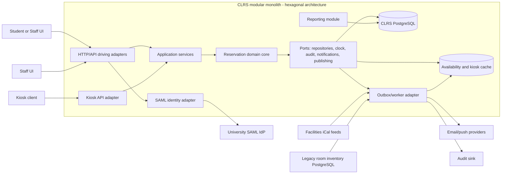

# CS 3410 Software Engineering — Assignment 2  
## Architecture and Quality Plan for the Campus Library Reservation System

## 1. Context and scope

The Campus Library Reservation System (CLRS) will replace the existing study-room reservation tool used across three university libraries. Students and staff will search for rooms, create and manage reservations, receive reminders, and view schedules through room kiosks. Library staff will manage rooms, opening hours, recurring block bookings and utilisation reports.

CLRS must integrate with three existing systems: the university SAML identity provider, facilities iCal feeds and a read-only PostgreSQL room-inventory database. The first release will provide the HTTP API, web or mobile user interface, staff interface, kiosk interface and scheduled notification/reporting capabilities.

This document defines the architecture and quality plan for the first release. It does not specify implementation-level code or the complete user-interface design. The most important design concerns are preventing conflicting reservations, maintaining acceptable search performance during semester-start demand, allowing future campus onboarding through configuration, supporting offline kiosk operation and enabling a small team to deploy and roll back safely.

The proposed solution is a **hexagonal architecture implemented as a modular monolith**. The reservation domain is framework-independent and communicates with databases, identity services, calendars, notifications and kiosk delivery through explicit ports. This provides strong testability and relatively simple operations while retaining the ability to extract components into services later if actual scale or organisational needs justify doing so.

---

## 2. Architectural decision

### 2.1 Decision

CLRS will use **Method C — Hexagonal architecture**, deployed initially as one modular application.

The system will contain a framework-independent domain core surrounded by:

- driving adapters, such as HTTP controllers, staff screens and kiosk clients;
- driven adapters, such as PostgreSQL repositories, SAML authentication, iCal integration, email/push providers and reporting storage;
- application services that coordinate use cases;
- an outbox-based asynchronous mechanism for notifications and kiosk updates.

The single deployment is a pragmatic operational choice, not a second primary architectural style. Internal modules will have clear interfaces and dependency rules so that a module can later be separated if necessary.

### 2.2 Rationale against the quality requirements

**QR-1 — Availability.**  
A modular monolith has fewer deployable processes and network connections than microservices. This reduces failure modes and makes it easier for a two-person team to operate. The application can run behind two instances and use a managed PostgreSQL database. Kiosk schedules will be stored in a read-optimised cache and retained locally by the kiosk client. If the kiosk or network is offline, it will display the last-known schedule, timestamped as stale.

The reservation write path will not depend synchronously on email, push notifications or the facilities calendar. Those integrations use adapters and asynchronous jobs, preventing a slow external provider from making reservation creation unavailable.

**QR-2 — Performance.**  
The search use case will access an indexed availability representation rather than repeatedly querying the legacy inventory database. Relevant room metadata will be synchronised from the read-only PostgreSQL source into CLRS-owned storage. Indexes will cover campus, capacity, equipment and time ranges. Frequently repeated searches may be cached briefly, while reservation writes invalidate affected availability entries.

The architecture allows the search adapter to be optimised independently from the domain rules. Load testing will validate p95 latency below 400 ms with 2,000 concurrent users.

**QR-3 — Security.**  
Authentication is isolated behind an identity port and SAML adapter. Controllers receive an authenticated user identity and roles, but domain services do not depend on SAML libraries. Staff operations pass through an authorisation policy and an audit port. Audit records contain the staff identity, action, target and outcome, but application logs contain only pseudonymous identifiers and never names, email addresses, SAML assertions or reservation notes containing personal information.

**QR-4 — Modifiability.**  
Campus-specific information—campus identifier, opening hours, timezone, room source mapping, notification settings and reporting configuration—is stored as data rather than code. The inventory and calendar adapters map external identifiers to a common internal model. Adding a campus therefore requires configuration, data loading and operational verification, not a new branch of application logic.

**QR-5 — Testability.**  
The reservation domain core has no database, HTTP, SAML or network dependencies. It receives values such as user, room, time interval and existing reservations and returns domain results or errors. Repository, clock, notification and audit interfaces are ports. Unit tests can therefore verify the three-hour daily limit, conflicts, block-booking precedence, 48-hour notice and modification rules entirely in memory.

**QR-6 — Operability.**  
A single deployable artifact is appropriate for a two-person team. Continuous integration can build, test and package the application once. Immutable container images, automated health checks and a blue/green or rolling deployment allow rollback to the previous image within ten minutes. Database migrations will use an expand-and-contract approach so that the previous application version remains compatible during rollback.

### 2.3 Rejected alternatives and trade-offs

#### Method A — Layered monolith

A layered monolith would be simple to deploy and would probably satisfy QR-1 and QR-6. However, traditional layered designs often allow application and domain logic to depend gradually on ORM entities, HTTP frameworks or database details. This would make QR-5 weaker: testing reservation rules could require database setup or cumbersome mocks. It also makes integration boundaries less explicit. Hexagonal architecture retains the operational simplicity of a monolith while enforcing stronger dependency inversion.

The cost of the selected approach is additional interfaces, dependency-injection configuration and adapter code.

#### Method B — Microservices

Microservices would allow independent scaling of search, reservation, notifications and reporting. This could help QR-2 if search demand greatly exceeded other workloads. Independent deployment might also isolate failures.

However, the first release does not justify the operational cost. Reservations, inventory, kiosks and notifications would require service-to-service communication, distributed tracing, separate deployment pipelines and more complicated consistency handling. A two-person team would have to operate multiple services, databases and failure-recovery procedures, conflicting with QR-6. Cross-service reservation consistency could also make QR-1 and the user experience worse. Microservices are therefore rejected initially, although the modular boundaries preserve a future extraction path.

#### Method D — Event-driven architecture with CQRS

CQRS and an event log would be attractive for QR-4, kiosk propagation and high-volume search. Events could update kiosk and search projections independently, and the event history would assist reporting and auditing.

The disadvantages are eventual consistency, replayable projection infrastructure and more complex failure recovery. A reservation might be accepted before a search projection or kiosk is updated. Although FR-4 permits an update within ten seconds, implementing reliable event delivery, idempotent consumers, projection repair and operational monitoring would add considerable complexity. The architecture will use a limited transactional outbox and asynchronous notifications, but not a full event-sourced CQRS system for the first release.

---

## 3. Structure

### 3.1 Container/component diagram

The arrows into the domain represent application use cases invoking the domain. The domain does not call concrete databases or external systems directly; it calls ports implemented by adapters.

### 3.2 Main components

- **HTTP/API adapters:** Validate request syntax, obtain the authenticated principal and invoke application use cases.
- **Application services:** Coordinate transactions for search, reservation, cancellation, block booking, reports and campus configuration.
- **Reservation domain core:** Owns reservation invariants and policies.
- **Repository adapters:** Persist reservations, rooms, opening hours, block bookings and audit/outbox records in CLRS PostgreSQL.
- **Inventory/calendar adapters:** Import room metadata and facilities availability from the legacy PostgreSQL database and iCal feeds.
- **Kiosk adapter:** Serves a compact schedule for a room and exposes a polling endpoint or server-sent events.
- **Outbox worker:** Publishes committed reservation changes to kiosk-cache update logic and notification jobs.
- **Reporting module:** Produces monthly utilisation exports from reservation and opening-hour data.

The database will enforce a final no-overlap constraint for reservations where supported, in addition to application-level validation. This protects against concurrent requests.

### 3.3 FR-1 walkthrough: search availability

1. The user calls `GET /rooms?campus=&capacity=&equipment=&from=&to=`.
2. The API adapter validates the time window and obtains the user’s SAML-authenticated identity.
3. The application search service queries the CLRS room and availability repositories.
4. The repository uses indexed local inventory and reservation data. It does not synchronously query the legacy database or facilities feed.
5. The service removes rooms that are closed, unavailable, already reserved or blocked during the requested interval.
6. Results are returned with room identifiers, campus, capacity, equipment and available intervals.
7. A short-lived cache may serve identical searches. Reservation changes invalidate or update affected cache entries.

### 3.4 FR-4 walkthrough: kiosk schedule updates

1. A reservation, modification, cancellation or block booking is committed transactionally with an outbox record.
2. The worker reads the outbox and publishes a room-specific schedule-change job.
3. The kiosk schedule cache is updated and versioned with the reservation change timestamp.
4. Kiosks poll their endpoint every five seconds, or maintain an SSE connection with polling fallback.
5. Under normal operation, the change is visible within ten seconds. The API includes the schedule version and generated-at timestamp.
6. If a kiosk loses connectivity, it retains the last successful schedule locally and displays “last updated” information. It does not accept reservations while offline.
7. Failed outbox jobs are retried with backoff and sent to a dead-letter queue after repeated failure.

---

## 4. Quality plan

### 4.1 Testing strategy

#### Unit tests

Unit tests target the framework-independent domain and application policies. They use in-memory repositories, a fake clock and fake notification/audit ports.

Important cases include:

- overlapping reservations and concurrent conflict handling;
- the three-hour daily limit, including reservations crossing midnight;
- create, modify and cancel permissions;
- recurring staff block bookings;
- 48-hour notice and override behaviour;
- opening hours, time zones and daylight-saving transitions;
- equipment, capacity and campus filtering;
- idempotency of repeated commands;
- kiosk schedule generation;
- reminder eligibility and duplicate-prevention logic.

These tests directly satisfy QR-5 because reservation rules execute without a database or network. Every pull request must pass the unit suite and maintain agreed coverage, with particular coverage for domain branches rather than relying only on a percentage target.

#### Integration tests

Integration tests use containerised PostgreSQL and verify:

- repository mappings and transactions;
- database indexes and overlap constraints;
- outbox atomicity;
- migration compatibility;
- cache invalidation;
- report queries and utilisation calculations.

External systems are replaced with controlled test servers for SAML, iCal, email and push. Tests verify timeouts, retries, malformed data and provider outages.

#### Contract tests

Provider and consumer contract tests will cover:

- CLRS API response schemas, status codes and error formats, including `409 Conflict`;
- kiosk schedule payload, version and timestamp fields;
- SAML claim and role mappings;
- iCal feed format and timezone assumptions;
- notification-provider request formats.

These tests ensure that adapters and clients can evolve without silently breaking one another.

#### End-to-end tests

A small, stable suite will run against a production-like environment. Scenarios include:

1. SAML login followed by room search and reservation;
2. two users attempting the same room and time, with exactly one successful reservation;
3. staff block booking and the resulting student notification;
4. cancellation followed by kiosk update within ten seconds;
5. reminder creation and delivery;
6. monthly report export;
7. kiosk offline operation and recovery.

#### Non-functional tests

Before release, load tests will simulate at least 2,000 concurrent users with semester-start search patterns. The acceptance target is p95 search latency below 400 ms and an error rate below 1%. Soak tests will identify memory leaks, while fault-injection tests will stop notification, calendar, cache and one application instance to verify graceful degradation.

Security testing will include dependency scanning, SAST, secret scanning, authentication/authorisation tests and verification that representative logs contain no PII.

### 4.2 Delivery

The repository will use short-lived feature branches and pull requests into `main`. `main` must remain releasable; emergency fixes use a short-lived hotfix branch.

CI gates are:

- formatting, linting and static analysis;
- unit tests;
- integration and contract tests;
- API/schema compatibility checks;
- dependency and container vulnerability scans;
- test coverage thresholds for domain and application modules;
- build of a versioned, immutable container image.

End-to-end and performance tests run before a release candidate is promoted. Deployment uses an automated pipeline to a staging environment, followed by smoke tests and an explicit approval for production.

Production deployment uses two application instances behind a load balancer. A new image is started alongside the old image, health-checked and gradually given traffic. Database migrations are backward-compatible: new structures are added first, both versions are supported, and old structures are removed only after rollback is no longer required.

The previous image and configuration remain available. If health checks fail, error rates rise or latency breaches the release threshold, traffic is returned to the previous version. A tested rollback runbook, automated image promotion and pre-created database backups target rollback within ten minutes, satisfying QR-6.

### 4.3 Observability

All requests receive a correlation ID. Structured logs record:

- timestamp, correlation ID, route and response status;
- duration, campus and room identifier where needed;
- outcome and error category;
- pseudonymous user ID only where required for diagnosis.

Logs must not contain names, email addresses, SAML assertions, access tokens, reservation descriptions or other PII. Staff actions are recorded separately in an access-controlled audit store containing actor, action, target, timestamp, outcome and reason.

Metrics include:

- successful and failed request counts;
- availability calculated during configured opening hours;
- search latency p50, p95 and p99;
- search timeout and error rates;
- active users and request concurrency;
- database query latency, connection pool saturation and cache hit ratio;
- reservation conflict rate;
- outbox age, retry count and dead-letter count;
- kiosk update propagation time;
- number of kiosks online, offline and using stale data;
- notification delivery success and delay.

Alerts include:

- monthly projected availability below 99.5%;
- five-minute search p95 above 400 ms during representative load;
- elevated 5xx responses or database failures;
- any kiosk schedule older than 60 seconds while connected;
- any kiosk offline beyond an agreed operational threshold;
- outbox items older than 30 seconds or dead-letter growth;
- failed SAML authentication spikes;
- notification jobs approaching the 15-minute reminder deadline.

Dashboards show availability and latency by campus, endpoint and deployment version. Synthetic probes periodically perform room searches and kiosk reads from each campus. Availability incidents are reviewed monthly against opening-hour minutes, not merely calendar minutes.

---

## 5. Risks and mitigations

| Risk | Likelihood / impact | Measurable trigger | Mitigation |
|---|---|---|---|
| Legacy inventory data is incomplete or inconsistent | Medium / High | More than 1% of imported rooms lack capacity, equipment or campus mapping in two consecutive imports | Build an import validator, quarantine invalid records, provide a staff reconciliation report and maintain a manual configuration override |
| Facilities iCal feeds are delayed or unavailable | Medium / High | Feed age exceeds 15 minutes or two consecutive imports fail | Cache the last valid feed, show data freshness, retry with backoff, alert staff and define an operational fallback process |
| Concurrent requests create double bookings | Medium / Critical | Any duplicate overlap found in reconciliation or failed concurrency test | Use transactional reservation creation, database exclusion/overlap constraints, idempotency keys and repeatable-read or serialised conflict handling |
| Search performance fails at semester start | Medium / High | Load test or production p95 exceeds 400 ms for five minutes, or database CPU exceeds 75% | Precompute/index availability, cache searches, tune queries, load-test realistic data and scale application instances horizontally |
| Kiosk updates exceed the ten-second requirement | Medium / High | More than 1% of reservation changes take over ten seconds to reach kiosks in a test or rolling 15-minute window | Use transactional outbox, room-specific cache updates, five-second polling, retries, stale-data indicators and local last-known storage |
| SAML integration or role mapping is incorrect | Medium / High | More than 0.5% of valid login attempts fail, or a role-mapping test fails | Obtain IdP test metadata early, automate claim/role contract tests, use least privilege and retain a controlled staff break-glass process |
| Two-person team cannot operate the system reliably | Medium / High | Any production procedure requires more than 30 minutes of undocumented manual work, or an unresolved alert remains for 24 hours | Automate deployment and backups, maintain runbooks, rehearse rollback monthly and limit the first release’s infrastructure |
| Migration or release causes an incompatible database change | Low / Critical | Rollback rehearsal exceeds ten minutes or old-version smoke tests fail after migration | Use expand-contract migrations, test both application versions, take backups and block deployment when compatibility checks fail |
| Reminder provider fails or sends duplicates | Medium / Medium | Delivery failure exceeds 2%, or duplicate reminders exceed 0.1% | Use an outbox, idempotency keys, retry/dead-letter handling, provider monitoring and a deduplication record |
| Requirements for block-booking overrides are ambiguous | Medium / High | Product-owner decisions remain unresolved one sprint before implementation | Confirm cancellation, notification, refund and notice rules in writing; create acceptance tests before development |

---

## 6. Open questions for the product owner

1. When a staff block booking overrides an existing student reservation, what notification, refund or appeal process is required?
2. Does the 48-hour notice apply to every occurrence of a recurring booking, or only to the initial creation?
3. Are reservations limited by the user’s local campus timezone, and how should daylight-saving transitions be handled?
4. What is the required retention period for reservation records, staff audit records and utilisation reports?
5. Which email and push providers are approved, and what delivery guarantee is expected for the 15-minute reminder?
6. How long may a kiosk display stale data before it must show an explicit outage warning?
7. Should kiosks support only viewing, or will any future release permit check-in, extension or cancellation?
8. What are the expected room and equipment counts and the peak duration of semester-start demand?
9. What roles exist beyond student and staff—for example, library manager, facilities administrator or system operator?
10. What accessibility, language and mobile-browser requirements must the first release meet?

---

### Appendix A — Generative AI declaration

Generative AI was used to assist with brainstorming, organisation and editing of this design document. The submitted document must be reviewed, corrected and adapted by the student, who remains responsible for the technical decisions, accuracy, originality and final content.